# FlashCookie - Apresentação do Aplicativo

## 📱 O que é o FlashCookie?

O **FlashCookie** é um aplicativo móvel desenvolvido especialmente para facilitar a gestão de estoque de matéria-prima em pequenas fábricas de cookies.

O aplicativo foi criado pensando em **simplicidade e praticidade**, utilizando inteligência artificial para tornar o trabalho do dia a dia muito mais fácil. Você não precisa ser expert em tecnologia para usar o FlashCookie!

---

## 🎯 Por que usar o FlashCookie?

### Problemas que o app resolve:

- ✅ **Elimina a necessidade de digitar manualmente** todos os itens da nota fiscal
- ✅ **Permite usar comandos de voz** para registrar saídas de estoque
- ✅ **Calcula automaticamente** quantos cookies você pode produzir com o estoque atual
- ✅ **Interface simples e intuitiva** que qualquer pessoa consegue usar
- ✅ **Funciona offline** - seus dados ficam seguros no seu celular

---

## 🚀 Principais Funcionalidades

### 1. 🔐 Login e Cadastro

**Como funciona:**

O primeiro passo é criar sua conta no aplicativo. É muito simples: você só precisa informar seu email e criar uma senha.

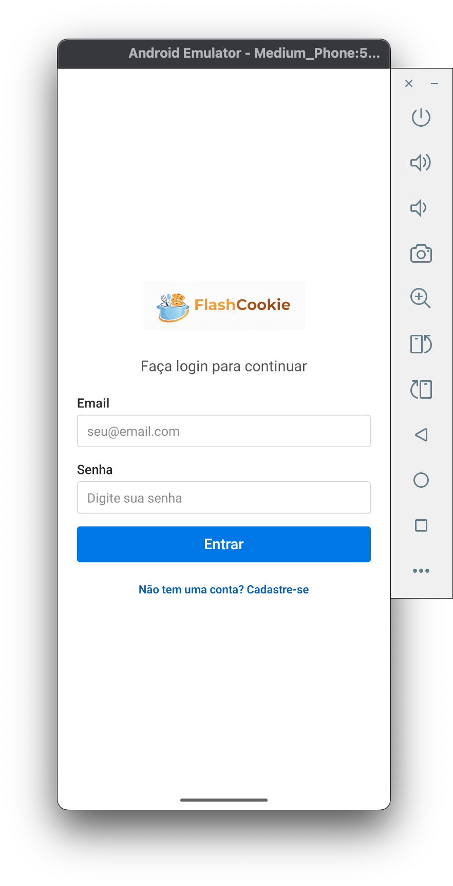

Depois de criar sua conta, você pode fazer login sempre que abrir o app. O aplicativo lembra que você está logado, então não precisa entrar toda vez.

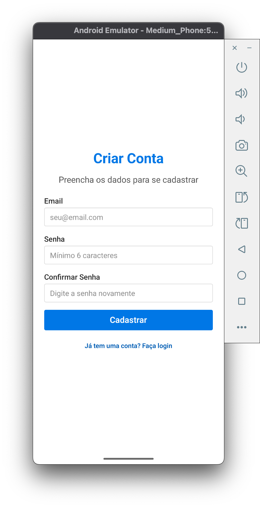

**Por que é útil:**

- Cada pessoa da equipe pode ter sua própria conta
- Seus dados ficam protegidos
- Você pode usar o app em diferentes dispositivos

---

### 2. 🏠 Tela Inicial (Home)

**Como funciona:**

Após fazer login, você verá a tela inicial com todas as opções principais do aplicativo. É como um menu principal onde você escolhe o que quer fazer.

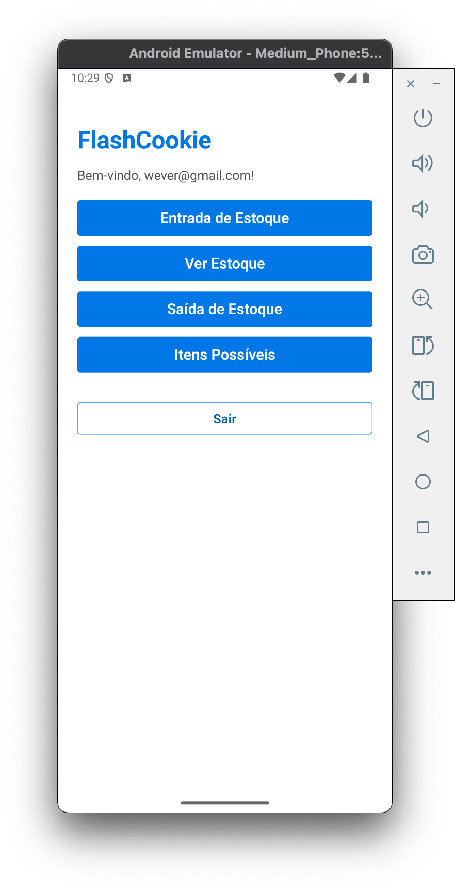

**Opções disponíveis:**

- **Entrada de Estoque** - Para adicionar novos produtos ao estoque
- **Ver Estoque** - Para ver tudo que você tem em estoque
- **Saída de Estoque** - Para registrar quando você usa ingredientes
- **Itens Possíveis** - Para ver quantos cookies você pode fazer
- **Sair** - Para sair da sua conta

---

### 3. 📥 Entrada de Estoque (Adicionar Produtos)

**Como funciona:**

Esta é uma das funcionalidades mais poderosas do FlashCookie! Quando você compra ingredientes e recebe uma nota fiscal, em vez de digitar tudo manualmente, você pode:

1. **Tirar uma foto da nota fiscal** ou escolher uma foto da galeria
2. O aplicativo **lê automaticamente** todos os itens da nota usando inteligência artificial
3. Você só precisa **confirmar ou ajustar** as informações

**Passo a passo:**

**Passo 1:** Abra a tela de Entrada de Estoque e escolha "Selecionar da Galeria" ou "Capturar Nota Fiscal"

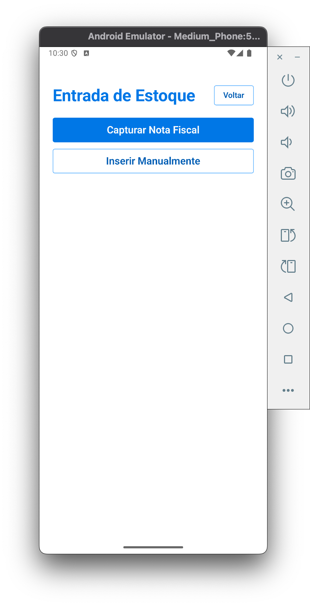

**Passo 2:** Depois de selecionar a imagem, o app mostra a foto que você escolheu

**Passo 3:** O aplicativo processa a imagem e extrai automaticamente todos os itens da nota fiscal

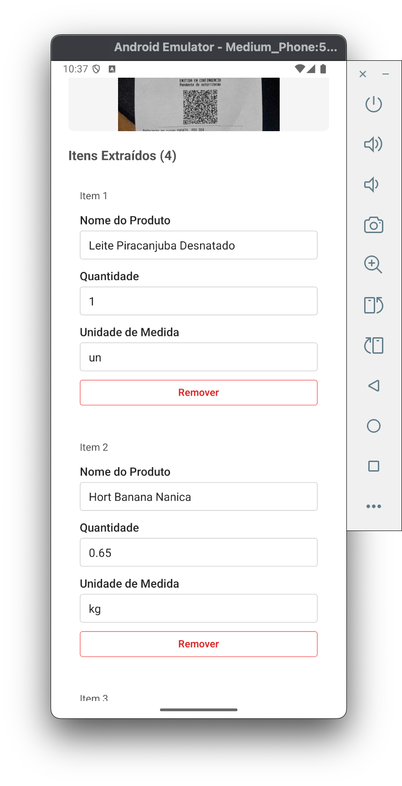

**Por que é útil:**

- ⚡ **Muito mais rápido** do que digitar tudo manualmente
- ✅ **Menos erros** - o app lê direto da nota fiscal
- 📸 **Simples** - só precisa tirar uma foto
- ✏️ **Você pode editar** se precisar corrigir algo

**Exemplo prático:**

Imagine que você comprou:

- 2,4 kg de farinha de trigo
- 900 g de açúcar refinado
- 1,2 kg de açúcar mascavo
- 1,3 kg de manteiga
- 8 ovos

Em vez de digitar cada item, você tira uma foto da nota fiscal e o app identifica tudo automaticamente!

---

### 4. 📤 Saída de Estoque (Registrar Uso de Ingredientes)

**Como funciona:**

Quando você vai fazer cookies e precisa usar ingredientes do estoque, você pode simplesmente **falar o que vai usar**! O aplicativo entende sua voz e registra automaticamente.

**Passo a passo:**

**Passo 1:** Abra a tela de Saída de Estoque e toque em "Falar o que vai usar"

**Passo 2:** Fale naturalmente, por exemplo: _"Vou usar 500 gramas de farinha, 200 gramas de açúcar e 8 ovos"_

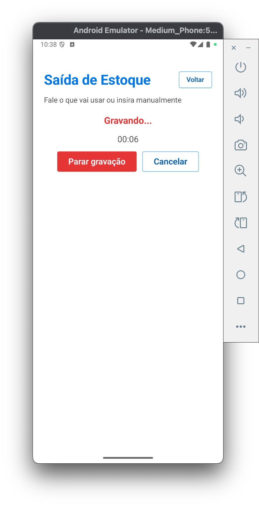

**Passo 3:** O aplicativo processa o que você falou e mostra os itens identificados

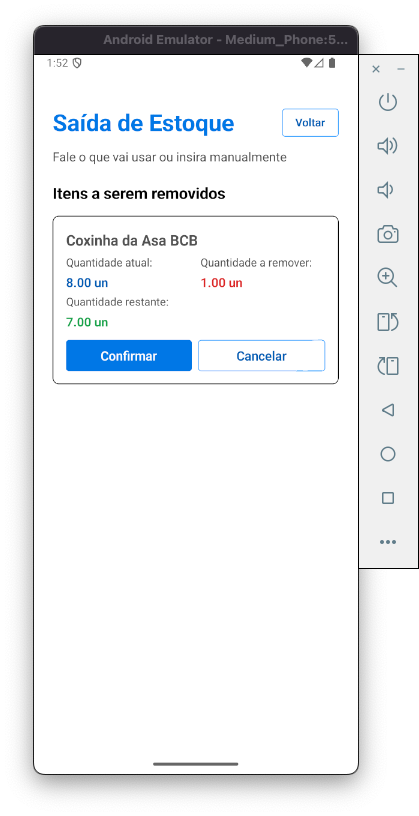

**Passo 4:** Você confirma cada item e o estoque é atualizado automaticamente

**Por que é útil:**

- 🎤 **Mãos livres** - você pode falar enquanto trabalha
- ⚡ **Rápido** - mais rápido do que digitar
- ✅ **Inteligente** - o app entende o que você quer dizer
- 📊 **Mostra o estoque atual** antes e depois da saída

**Exemplo prático:**

Você está na cozinha preparando uma receita e precisa usar ingredientes. Em vez de parar para digitar no celular, você simplesmente fala: _"Vou usar 300 gramas de manteiga e 100 gramas de chocolate"_. O app entende e registra tudo!

---

### 5. 📦 Ver Estoque

**Como funciona:**

Esta tela mostra uma lista completa de tudo que você tem em estoque no momento. É como um inventário sempre atualizado.

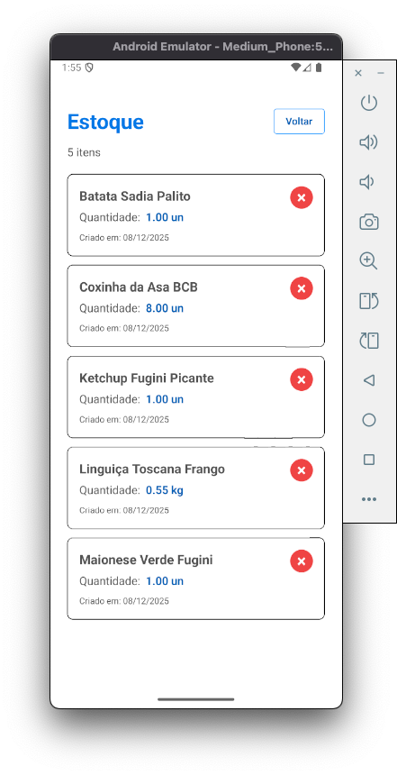

**O que você vê:**

- Nome de cada ingrediente
- Quantidade disponível
- Unidade de medida (kg, g, L, mL, unidades)

**Por que é útil:**

- 👀 **Visão completa** do seu estoque a qualquer momento
- 📊 **Organizado** - tudo em um só lugar
- 🔍 **Fácil de encontrar** - você pode ver rapidamente o que tem disponível
- 🗑️ **Pode excluir** itens que não usa mais

---

### 6. 🍪 Itens Possíveis (Receitas e Capacidade Produtiva)

**Como funciona:**

Esta é uma funcionalidade muito especial! O FlashCookie ajuda você a saber **quantos cookies você pode fazer** com o estoque atual.

**Funcionalidades:**

#### 6.1 Cadastrar Receitas

Você pode cadastrar suas receitas de cookies no aplicativo. Pode fazer isso de duas formas:

**Opção 1: Falar os ingredientes**

Você pode simplesmente falar os ingredientes da receita e o app identifica tudo automaticamente!

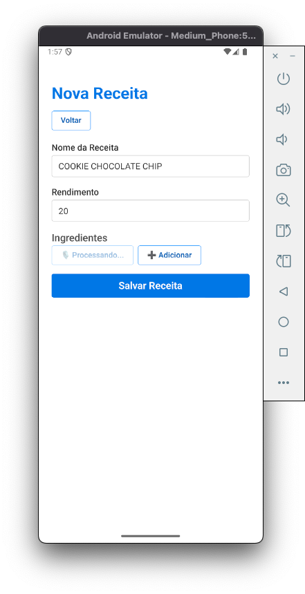

Depois de processar, o app mostra todos os ingredientes que identificou:

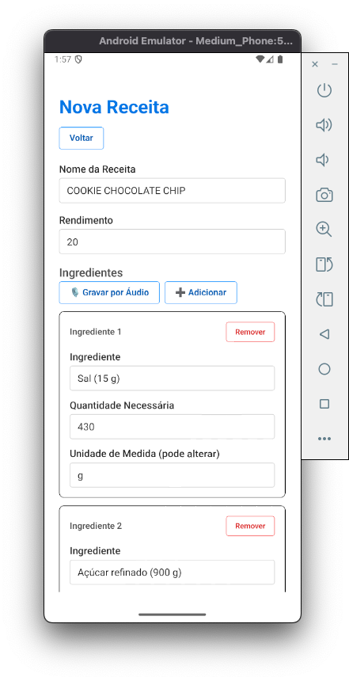

**Opção 2: Digitar manualmente**

Se preferir, você também pode digitar os ingredientes manualmente.

#### 6.2 Calcular Capacidade Produtiva

Depois de cadastrar suas receitas, você pode selecionar uma ou mais receitas e pedir para o app calcular quantos cookies você consegue fazer com o estoque atual.

O aplicativo usa inteligência artificial para analisar:

- Quais receitas você selecionou
- Quanto de cada ingrediente você tem em estoque
- Quanto de cada ingrediente cada receita precisa

E então mostra um relatório completo:

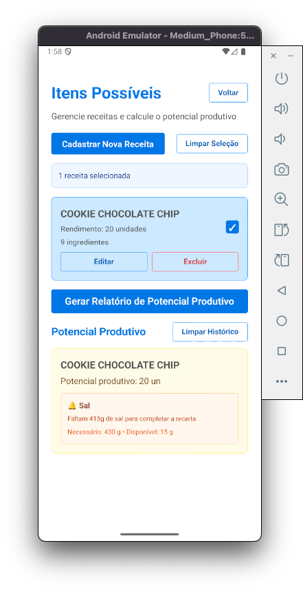

**Por que é útil:**

- 📊 **Planejamento** - você sabe exatamente quantos cookies pode fazer
- 💰 **Economia** - evita comprar ingredientes desnecessários
- ⏰ **Tempo** - ajuda a planejar a produção
- 🎯 **Decisões inteligentes** - baseadas em dados reais do seu estoque

**Exemplo prático:**

Você tem cadastradas 3 receitas diferentes de cookies. O app analisa seu estoque e diz:

- "Com o estoque atual, você pode fazer 50 unidades da Receita A"
- "Você pode fazer 30 unidades da Receita B"
- "Você pode fazer 25 unidades da Receita C"

Assim você sabe exatamente o que pode produzir!

---

## 💡 Dicas de Uso

### Dicas para Entrada de Estoque:

- 📸 Tire fotos bem iluminadas da nota fiscal
- ✅ Sempre revise os itens extraídos antes de confirmar
- ✏️ Você pode editar qualquer informação se necessário

### Dicas para Saída de Estoque:

- 🎤 Fale claramente e em um ambiente sem muito barulho
- 📝 Você pode falar as quantidades de forma natural: "500 gramas" ou "meio quilo"
- ✅ Sempre confirme os itens antes de finalizar

### Dicas para Receitas:

- 📋 Cadastre todas as suas receitas principais
- 🔄 Atualize as receitas se mudar alguma coisa
- 📊 Use o relatório de capacidade produtiva para planejar compras

---

## 🔒 Segurança e Privacidade

- ✅ Seus dados ficam armazenados no seu próprio celular
- ✅ Cada usuário tem sua própria conta
- ✅ Você pode sair da conta a qualquer momento
- ✅ Não compartilhamos seus dados com ninguém

---

## 📞 Suporte

Se você tiver dúvidas ou encontrar algum problema:

1. Verifique se está usando a versão mais recente do aplicativo
2. Tente fechar e abrir o app novamente
3. Se o problema persistir, entre em contato com o suporte

---

## 🎉 Conclusão

O **FlashCookie** foi desenvolvido para tornar a gestão de estoque simples, rápida e inteligente. Com o uso de inteligência artificial, tarefas que antes levavam muito tempo agora são feitas em segundos!

**Principais benefícios:**

- ⚡ **Economia de tempo** - menos tempo digitando, mais tempo produzindo
- ✅ **Menos erros** - o app ajuda a evitar erros de digitação
- 📊 **Melhor planejamento** - você sabe exatamente o que pode produzir
- 🎯 **Simplicidade** - qualquer pessoa consegue usar

**Comece a usar hoje mesmo e veja como sua gestão de estoque fica muito mais fácil!** 🚀

---

_Documento criado para facilitar o entendimento do aplicativo FlashCookie por pessoas não técnicas._
